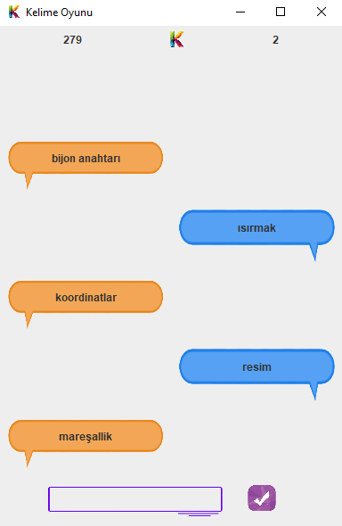

# WordGame
In the past, I created a game with Python. When I learned Java, I thought that I could convert this program to Java and implement a GUI. Here is the game. 

How To Play!

In this game I used Turkish dictionary as a word database. First word comes from the computer. It chooses a word from dictionary and print to the screen and the player must enter a word which starts with the letter which is the last letter of the computer's word. There is a time counter and also word counter at the top. 

Example Game:

-your junior developer Durmus Berk
